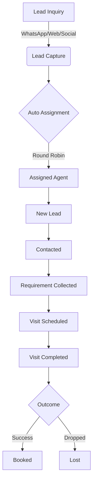
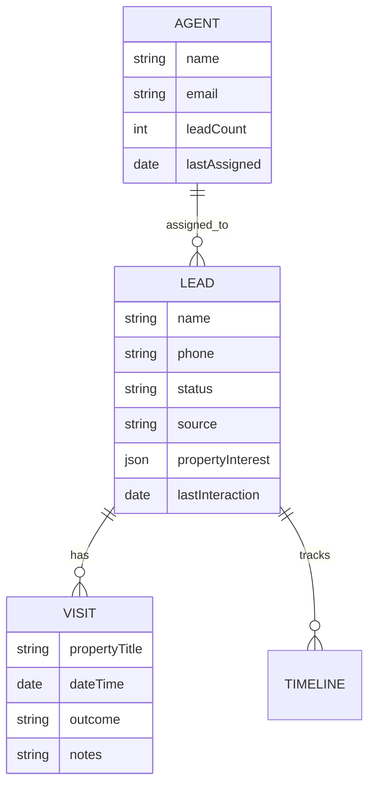

# Gharpayy Lead Management System (CRM) MVP

A dedicated interior CRM system for **Gharpayy** to automate lead capture, assignment, and sales pipeline management for PG accommodations in Bangalore.

---

## 🚀 Overview
Gharpayy handles inquiries from various sources like WhatsApp, Website, Social Media, and more. This MVP streamlines that process, ensuring every lead is centrally captured, assigned to an owner, and tracked through a clear sales pipeline.

## 🛠️ Technology Stack
- **Frontend**: React 19 + Vite (Modern, high performance)
- **Styling**: Tailwind CSS v4 (Utility-first, responsive, premium UI)
- **Backend**: Node.js + Express (Scalable RESTful API)
- **Database**: MongoDB (Flexible, NoSQL for evolving lead profiles)
- **State/API**: Axios + Framer Motion (Smooth micro-interactions)

---

## 🏗️ System Architecture
The system follows a clean **MERN stack** architecture with specific focus on **automation** and **visibility**.

### 🔄 Lead Lifecycle Workflow



### 1. Lead Capture & Automation
Leads from website forms, WhatsApp, and social media are captured via a central POST endpoint. Upon submission:
- A unique **Lead Profile** is created.
- A **Round-Robin** assignment algorithm automatically binds the lead to an active agent.
- A **Timeline Event** is recorded for full auditability.

### 2. Lead Assignment (Ownership)
Each lead must have exactly one owner. The system ensures fair distribution:
- **Round-Robin**: Leads are assigned to the agent who was assigned a lead the longest time ago.
- **Agent Workload**: Agents track their `currentLeadCount` to maintain balance.

### 3. Sales Pipeline (Pipeline Stages)
Visualized progress tracking through 8 key stages:
`New Lead` → `Contacted` → `Requirement Collected` → `Property Suggested` → `Visit Scheduled` → `Visit Completed` → `Booked` → `Lost`.

### 4. Visit & Follow-up Scheduling
- Agents can schedule property visits directly on the lead profile.
- Automated reminders flag leads that haven't been touched in over **24 hours**.

---

## 📊 Database Design
The schema is built for **traceability** and **scalability**.

### 🏗️ Entity Relationship Diagram



- **Lead**: Stores identity, source, status, assignment, and a rich `timeline` of interactions.
- **Agent**: Tracks availability, status, and assignment history.
- **Visit**: Manages property logistics, timing, and outcomes.

---

## 📈 Scalability Considerations
For a full production deployment at Gharpayy, we should implement:
1.  **WhatsApp/Meta API Integration**: Real-time two-way messaging within the CRM.
2.  **Webhooks & Third-Party Connectors**: Native support for **Tally.so**, **Calendly**, and **Google Forms**.
3.  **Real-time Notifications**: Using **WebSockets (Socket.io)** for instant agent alerts on new leads.
4.  **Worker Queues**: Using **BullMQ** or **Redis** to ensure zero-latency lead distribution during peak hours.
5.  **Analytics Engine**: Advanced reporting for agent performance and conversion funnels.

---

## ⚙️ Running Locally

### 1. Prerequisites
- Node.js (v18+)
- MongoDB (Running locally or via Atlas)

### 2. Backend Setup
```bash
cd backend
npm install
npm run dev
# Optional: Seed sample data
node seed.js
```
*Note: Create a `.env` file in /backend with `MONGODB_URI` and `PORT`.*

### 3. Frontend Setup
```bash
cd frontend
npm install
npm run dev
```

---

## 📝 Technical Expectations & Tools
To build the full Gharpayy CRM platform effectively, the following would be my core expectations:

### Expected Tools:
- **Cloud Infrastructure**: AWS (EC2/Lambda) or Vercel/DigitalOcean for high uptime.
- **Communication APIs**: Twilio Segment or MessageBird for lead intake.
- **Monitoring**: Sentry for error tracking and PostHog for user behavior analytics.
- **UI System**: Continued use of **Lucide-React** and **Framer Motion** for a premium commercial-grade experience.

### Why This Architecture Fits:
This setup prioritized **Data Integrity** (through MongoDB & Mongoose) and **Speed of Iteration** (Vite + React 19). For a high-growth startup like Gharpayy, these are the most critical factors for building a system that can evolve directly into a complete Lead Conversion System (LCS).

---

**Built with passion for the Gharpayy CRM Assignment.**
**Contact**: gharpayy@gmail.com | Subject: LCS CRM
